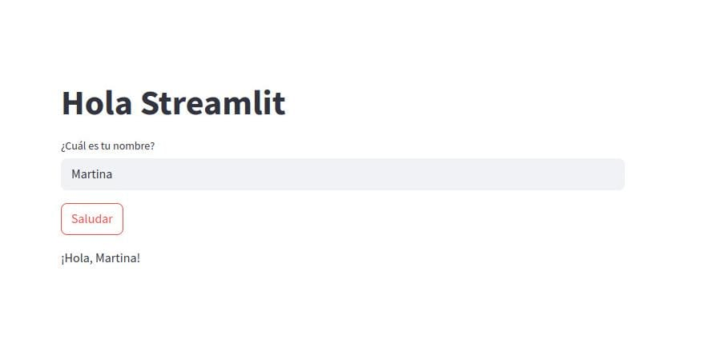

# Aplicación de Saludo con Streamlit

## Vista previa de la aplicación

Bienvenido/a a la **Aplicación de Saludo con Streamlit**.

Esta app permite a los usuarios ingresar su nombre y recibir un saludo personalizado de manera sencilla y rápida, utilizando la tecnología de Streamlit.


## Características
- 🚀 Interfaz simple
- 🔄 Actualización en tiempo real

## Requisitos
- Python 3.x
- Streamlit (>=1.32.0)
- Navegador web moderno

## Estructura del Proyecto
```
App-Streamlit/
├── app.py              # Aplicación principal
├── requirements.txt    # Dependencias del proyecto
├── docs/              # Documentación
│   ├── images/        # Imágenes de la documentación
│   ├── index.md       # Página principal
│   └── stapp.md       # Detalles de la aplicación
├── LICENSE            # Licencia del proyecto
└── README.md          # Información general
```

## Instalación
1. Clona este repositorio:
   ```bash
   git clone https://github.com/tu-usuario/App-Streamlit.git
   cd App-Streamlit
   ```
2. Instala las dependencias ejecutando:
   ```bash
   pip install -r requirements.txt
   ```

## Uso
Para ejecutar la aplicación, utiliza el siguiente comando:
```bash
streamlit run app.py
```
La app se abrirá automáticamente en tu navegador web predeterminado en `http://localhost:8501`.

## Contribuir
¡Las contribuciones son bienvenidas! Si deseas contribuir:
1. Haz un Fork del proyecto
2. Crea una rama para tu característica (`git checkout -b feature/AmazingFeature`)
3. Haz commit de tus cambios (`git commit -m 'Add some AmazingFeature'`)
4. Push a la rama (`git push origin feature/AmazingFeature`)
5. Abre un Pull Request

Para más detalles, consulta nuestra [guía de contribución](Contribuir.md).

## Enlaces útiles
- [Documentación de Streamlit](https://docs.streamlit.io/)
- [Comunidad de Streamlit](https://discuss.streamlit.io/)
- [Ejemplos de Streamlit](https://streamlit.io/gallery)

## Licencia
Este proyecto está bajo la licencia **Apache 2.0**. Consulta el archivo [LICENSE](LICENSE) para más detalles. 